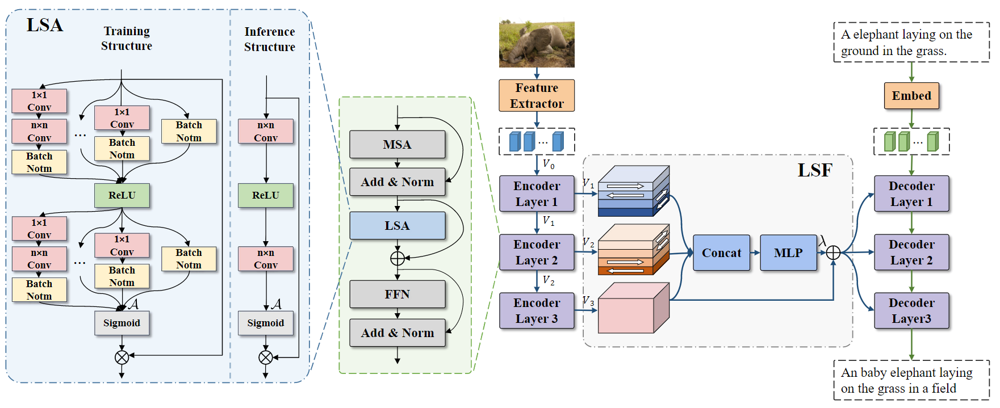

# Towards Local Visual Modeling for Image Captioning

Official Code for ["Towards Local Visual Modeling for Image Captioning"](https://www.sciencedirect.com/science/article/abs/pii/S0031320323001218) 



## Environment setup

Please refer to [meshed-memory-transformer](https://github.com/aimagelab/meshed-memory-transformer)

## Data preparation

* **Annotation**. Download the annotation file [annotation.zip](https://drive.google.com/file/d/1i8mqKFKhqvBr8kEp3DbIh9-9UNAfKGmE/view?usp=sharing). Extarct and put it in the project root directory.
* **Feature**. You can download our ResNeXt-101 feature (hdf5 file) [here](https://pan.baidu.com/s/1xVZO7t8k4H_l3aEyuA-KXQ). Acess code: jcj6.
* **evaluation**. Download the evaluation tools [here](https://pan.baidu.com/s/1xVZO7t8k4H_l3aEyuA-KXQ). Acess code: jcj6. Extarct and put it in the project root directory.

## Training
```python
python train.py --exp_name LSTNet --batch_size 50 --rl_batch_size 100 --workers 4 --head 8 --warmup 10000 --features_path /home/data/coco_grid_feats2.hdf5 --annotation /home/data/m2_annotations --logs_folder tensorboard_logs
```
## Evaluation
```python
python eval.py --batch_size 50 --exp_name LSTNet --features_path /home/data/coco_grid_feats2.hdf5 --annotation /home/data/m2_annotations
```

## Visualization


## Citation

```
@article{ma2023towards,
  title={Towards local visual modeling for image captioning},
  author={Ma, Yiwei and Ji, Jiayi and Sun, Xiaoshuai and Zhou, Yiyi and Ji, Rongrong},
  journal={Pattern Recognition},
  volume={138},
  pages={109420},
  year={2023},
  publisher={Elsevier}
}
```